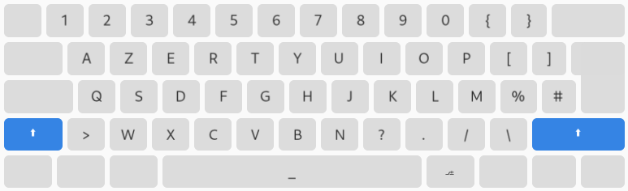

# xkb AZERTY variant for developers ⌨️

The AZERTY layout isn't all bad, but some symbols that developers use over and over again are difficult to type.
The aim of this layout is to make the most common symbols accessible to developers without requiring them to relearn how to type from scratch.

## Screenshots

## Install ⚙️

Requirements: this script requires `xmlstarlet` to run

- Run `install.sh` as root
- Restart your desktop environment and choose the variant as your default layout

Note: the variant can be temporarily selected using `setxkbmap`

## Uninstall

Requirements: same as installation

- Run `uninstall.sh` as root

The layout will no longer be available once the desktop environment has restarted